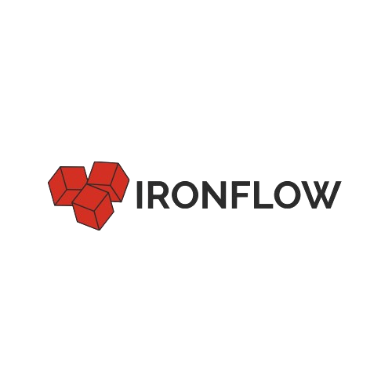

<p align="start">
  
</p>


# IronFlow

## Introduction

**IronFlow** is a modular application framework built on top of [Laravel](https://laravel.com).  
Its purpose is to simplify the development of **scalable, maintainable, and extensible applications**, while remaining fully compatible with Laravel’s ecosystem and tooling.

 <p align="start">
  <a href="https://packagist.org/packages/ironflow/ironflow">
    
  </a>
  <a href="https://packagist.org/packages/ironflow/ironflow">
    
  </a>
  <a href="https://packagist.org/packages/ironflow/ironflow">
    
  </a>
 </p>


## Vision

As projects grow in complexity, developers often face challenges in separation of concerns, maintainability, and modularity.  
While Laravel provides a robust foundation, larger applications often require stricter architectural conventions.

IronFlow addresses these challenges by introducing:

- **True modularity**: self-contained modules with controllers, models, services, routes, views, and database.
- **Anvil**: a dedicated module manager for discovery, dependency resolution, and boot orchestration.
- **Performance-first booting**: lazy-loading, async, and selective module activation.
- **Integrated tooling**: extended Artisan commands to support modular workflows.
- **Controlled overrides**: safe prioritization between global app entities and module-defined entities.

---

## Core Features

- **Dynamic modules**  
  Register, enable, disable, and manage modules easily.  

- **Dependency management**  
  Declarative dependencies and versioning between modules.  

- **Publishing & distribution**  
  Convert modules into standalone packages for Packagist.  

- **Dedicated CLI**  
  Extended Artisan with commands like:  
  - `ironflow:module:create`
  - `ironflow:module:publish`
  - `ironflow:module:install`
  - `ironflow:make:model`, `ironflow:make:controller`, `ironflow:make:service`  

- **Seamless integration**  
  Extended support for migrations, factories, and seeders within modules.  

- **Skeleton project**  
  Ready-to-use Laravel boilerplate with IronFlow pre-installed.  


## Installation

### Add IronFlow to an existing Laravel project

```bash
composer require ironflow/ironflow
````

Publish the configuration and create your first module:

```bash
php artisan vendor:publish --tag=ironflow-config
php artisan ironflow:module:create Blog
```

### Create a new IronFlow project

```bash
composer create-project ironflow/skeleton my-app
```

This will scaffold a new Laravel project pre-configured with IronFlow and example modules.

## Module Structure

```
App/Modules/Blog/
    Controllers/
    Services/
    Models/
    Routes/
    Resources/
        views/
    Database/
        migrations/
        seeders/
        factories/
    BlogModule.php
```

## Contributing

IronFlow is open-source and community-driven.
We welcome contributions from developers of all levels. You can help by:

* Reporting issues or proposing features.
* Submitting pull requests (see [CONTRIBUTING.md](./CONTRIBUTING.md)).
* Sharing feedback and real-world use cases.

---

## License

IronFlow is released under the **MIT License**.
Certain premium packages (e.g. SaaS boilerplate, multi-tenant support) may be provided in the future to sustain development.

## Philosophy

> *"Building a framework isn’t about reinventing the wheel.
> It’s about providing a stronger structure that helps developers go further."*

IronFlow stands for:

* **Practicality**: fully leveraging Laravel’s ecosystem.
* **Modularity**: true separation of concerns.
* **Efficiency**: lazy-loaded, asynchronous booting.
* **Openness**: community-driven with a transparent roadmap.

<p align="center">
Forged with passion ❤️ by Aure Dulvresse
</p>
