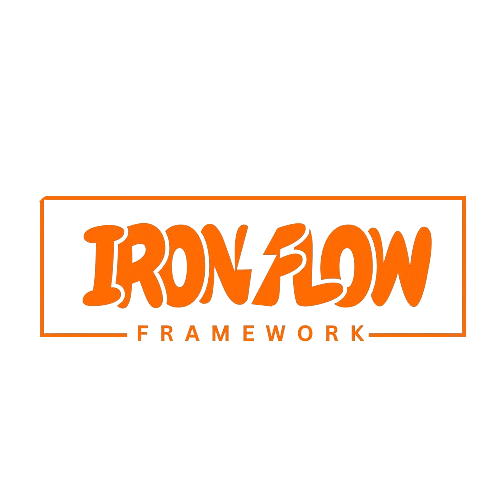

# IronFlow Framework

<div align="center">



[](https://php.net)
[](LICENSE)
[](https://github.com/ironflow/framework/actions)
[](https://codecov.io/gh/ironflow/framework)
[](https://github.styleci.io/repos/ironflow/framework)

</div>

## À propos
IronFlow est un framework PHP léger, rapide et modulaire inspiré de Django, Laravel et Rails. Conçu pour les développeurs à la recherche d'une solution flexible et évolutive, IronFlow facilite la création d'applications web modernes, qu’il s’agisse de blogs, de SaaS ou de sites e-commerce.

## ✨ Pourquoi IronFlow ?
- ⚡ Rapide : exécution optimisée et système de cache intégré.
- 🧩 Modulaire : activez ou désactivez des modules selon les besoins.
- 📦 Léger : dépendances minimales et installation rapide via Composer.
- 📂 Structuré : basé sur le pattern MVC pour un code clair et maintenable.
- 🔧 Flexible : système de configuration simple via fichiers .env et config/.
- 🛠️ ORM maison : Iron ORM pour la gestion des bases de données relationnelles.
- 🎨 Twig intégré : moteur de templates puissant pour vos vues.

## 📋 Prérequis Système

- PHP 8.2 ou supérieur
- Composer 2.0+
- Extensions PHP requises :
  - PDO
  - JSON
  - Mbstring
  - OpenSSL
  - Tokenizer
  - XML
- Une base de données MySQL, PostgreSQL ou SQLite
- Un serveur web (Apache, Nginx, etc.)

## 🚀 Installation Rapide

### Via Composer

```bash
# Création du projet
composer create-project ironflow/framework mon-projet

# Configuration
cd mon-projet
cp .env.example .env

# Génération de la clé d'application
php forge key:generate

# Installation des dépendances
composer install

# Configuration des permissions
chmod -R 777 storage bootstrap/cache
```

### Manuellement

1. **Cloner le repository**:

   ```bash
   git clone https://github.com/ironflow/framework.git
   cd framework
   ```

2. **Installer les dépendances**:

   ```bash
   composer install
   ```

3. **Configurer l'environnement**:

   ```bash
   cp .env.example .env
   php forge key:generate
   ```

4. **Lancer le serveur**:

   ```bash
   php forge serve
   ```

   Votre application est maintenant accessible à l'adresse [http://localhost:8000](http://localhost:8000)

## 📞 Support

- Documentation : [https://ironflow.dev/docs](https://ironflow.dev/docs)
- Issues : [GitHub Issues](https://github.com/ironflow-framework/framework/issues)
- Discussions : [GitHub Discussions](https://github.com/ironflow-framework/framework/discussions)
- Email : ironflow.framework@gamil.com
<div align="center">
Forgé avec passion et ❤️ by the IronFlow Team
</div>
